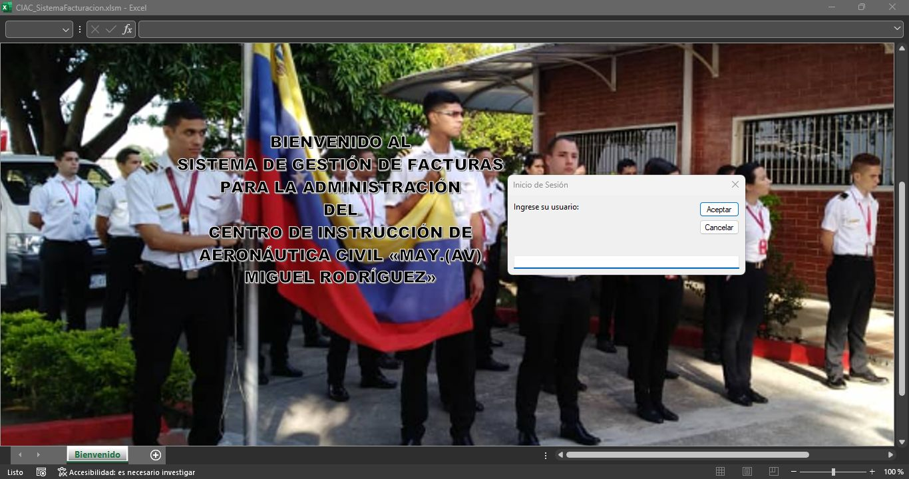
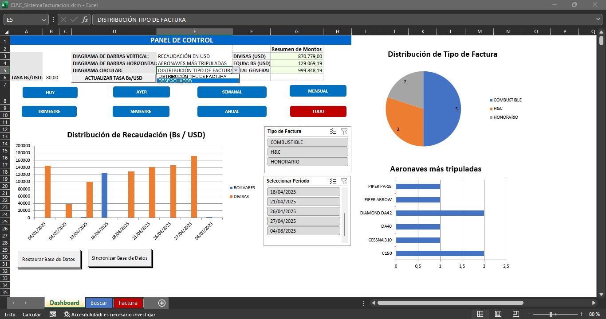
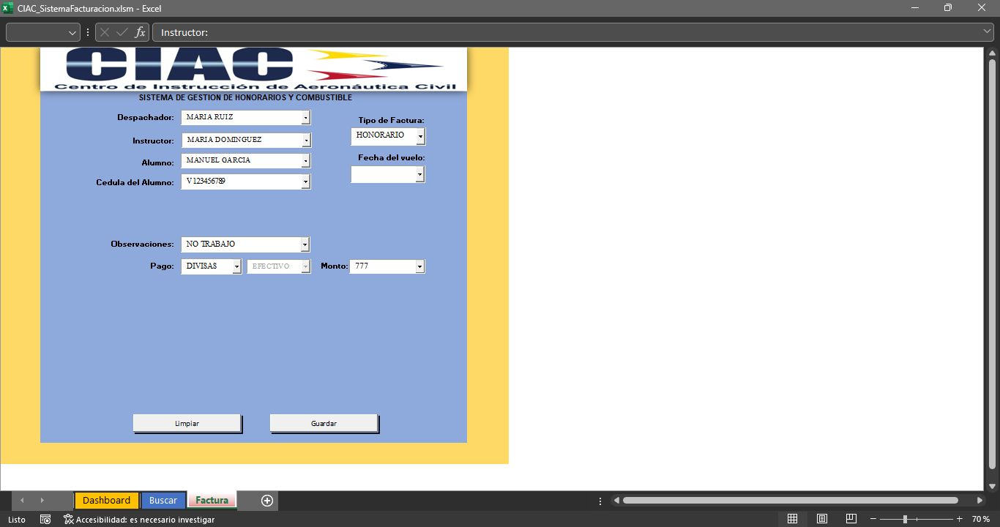
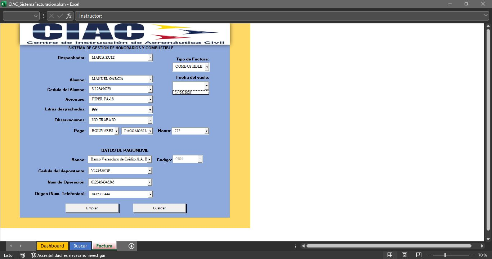

# 📋 CIAC — Sistema de Gestión de Facturas

> **Sistema de registro y gestión administrativa de facturas desarrollado en Microsoft Excel con VBA** para el Centro de Instrucción de Aeronáutica Civil «May.(Av) Miguel Rodríguez» (CIAC), Estado Aragua, Venezuela.

---

## 📸 Vista Previa

| Pantalla de Bienvenida | Panel de Control (Dashboard) |
|:---:|:---:|
|  |  |

| Registro de Factura (Honorario) | Registro de Factura (Combustible) |
|:---:|:---:|
|  |  |

---

## 📌 Descripción

La administración del CIAC requería una solución práctica para **digitalizar y centralizar** el registro de sus facturas de honorarios y combustible, hasta entonces manejadas en talonarios físicos. Este sistema fue diseñado como un libro Excel habilitado para macros (`.xlsm`) que:

- Permite registrar, buscar, filtrar y exportar facturas.
- Muestra estadísticas en tiempo real mediante un dashboard interactivo.
- Implementa un sistema de usuarios con distintos niveles de acceso.
- Soporta trabajo multiusuario mediante sincronización de archivos en red local.
- Genera reportes en PDF directamente desde la interfaz.

---

## 🗂️ Estructura del Repositorio

```
CIAC-SistemaFacturacion/
├── CIAC_SistemaFacturacion.xlsm       # Archivo principal del sistema
├── README.md
├── .gitignore
│
├── docs/
│   ├── MANUAL_BASICO_DE_USUARIO.pdf   # Manual de usuario
│   └── MANUAL_BASICO_DE_USUARIO.docx  # Manual de usuario (editable)
│
├── src/
│   └── vba/                           # Código VBA exportado por módulos
│       ├── ThisWorkbook.vba           # Eventos del libro (Open, Close, logging)
│       ├── Modulo1_Validaciones.vba   # Funciones de validación de datos
│       ├── Modulo2_Formularios.vba    # Gestión de formularios y campos
│       ├── Modulo3_DatosPrueba.vba    # Generador de datos de prueba
│       ├── Modulo4_Sesion.vba         # Sistema de autenticación y sesiones
│       ├── Modulo5_Dashboard.vba      # Generación de gráficos y dashboard
│       ├── Hoja1_Dashboard.vba        # Eventos de la hoja Dashboard
│       ├── Hoja2_Factura.vba          # Eventos de la hoja Factura
│       └── Hoja3_Buscar.vba           # Eventos de la hoja Buscar
│
└── assets/
    └── screenshots/                   # Capturas de pantalla del sistema
```

---

## ⚙️ Requisitos

| Requisito | Detalle |
|---|---|
| **Software** | Microsoft Excel 2016 o superior (recomendado 2021) |
| **Macros** | Deben estar habilitadas (ver sección de instalación) |
| **Sistema Operativo** | Windows 10 / 11 |
| **Extensión del archivo** | `.xlsm` (Libro de Excel habilitado para macros) |

---

## 🚀 Instalación y Primer Uso

### 1. Habilitar macros
Al abrir el archivo, Excel mostrará una barra de advertencia amarilla en la parte superior. Haz clic en **"Habilitar contenido"**.

Para habilitarlas de forma permanente:
1. Ve a `Archivo → Opciones → Centro de confianza → Configuración del Centro de confianza`.
2. Selecciona **"Configuración de macros"**.
3. Elige **"Deshabilitar todas las macros con notificación"** (recomendado) o agregar la carpeta del archivo como **Ubicación de confianza**.

### 2. Iniciar sesión
El sistema tiene 3 niveles de usuario:

| Usuario | Rol | Acceso |
|---|---|---|
| `00` | Técnico | Acceso total sin restricciones |
| `01` | Administrador | Dashboard, Facturas, Búsqueda y generación de PDF |
| `02` | Asistente | Solo registro de combustible y vista del Dashboard |

> Las contraseñas se manejan de forma separada al manual por razones de seguridad.

---

## 🧩 Funcionalidades Principales

### 📊 Dashboard Interactivo
- Gráficos de recaudación en Bs y USD por período (Hoy / Semanal / Mensual / Anual / Todo).
- Diagrama de distribución por tipo de factura (Honorario, Combustible, H&C).
- Top 5 instructores y aeronaves más operadas.
- Segmentadores de datos para filtrado por tipo de factura y período.
- Resumen de montos totales con conversión de divisas configurable (Tasa Bs/USD ajustable).

### 🧾 Registro de Facturas
Tres tipos de facturas registrables desde la hoja **Factura**:

| Tipo | Campos principales |
|---|---|
| **Honorario** | Despachador, Instructor, Alumno, Cédula, Fecha vuelo, Pago, Monto |
| **Combustible** | Despachador, Alumno, Aeronave, Litros despachados, Fecha vuelo, Datos de pago (incluye Pagomóvil) |
| **H&C** | Combinación de ambos tipos anteriores |

- **Autocompletado** de datos ya registrados en el sistema.
- **Validaciones** en tiempo real para evitar datos inconsistentes.
- Soporte para métodos de pago: **Efectivo** y **Pagomóvil** (con datos bancarios).

### 🔍 Búsqueda y Edición de Registros
*(Disponible para usuarios 00 y 01)*
- Filtro por campo (Despachador, Instructor, Alumno, Aeronave, Tipo de pago, etc.).
- Filtro por período temporal (Hoy, Ayer, Semanal, Mensual, Trimestral, Semestral, Anual, Todo).
- Modificación directa de registros encontrados.
- Exportación de resultados a **PDF** con un clic.

### 🔄 Sincronización Multi-archivo
*(Disponible para usuarios 00 y 01)*
- Permite que **varios usuarios** trabajen con copias del archivo en red local.
- Botón **"Sincronizar Base de Datos"**: unifica los datos de todos los archivos en la misma carpeta.
- Botón **"Restaurar Base de Datos"**: revierte la base de datos local en caso de errores.

### 📝 Sistema de Logs
- Registro automático de todas las acciones importantes: inicio de sesión, cierres, activación de hojas, errores.
- Rotación automática del log al superar 50,000 registros.
- Accesible desde la hoja **Log** (solo para usuario 00).

---

## 🏗️ Arquitectura Técnica

El sistema está construido sobre un único libro Excel `.xlsm` con las siguientes hojas:

| Hoja | Descripción | Visibilidad |
|---|---|---|
| **Bienvenido** | Pantalla de inicio y login | Siempre visible al abrir |
| **Dashboard** | Panel de control con gráficos | Usuarios 00, 01, 02 |
| **Factura** | Formulario de registro | Usuarios 00, 01, 02 |
| **Buscar** | Búsqueda y edición de facturas | Usuarios 00, 01 |
| **Facturas** | Base de datos de facturas | Oculta (solo VBA) |
| **Datos** | Base de datos de usuarios | Oculta (solo VBA) |
| **Extras** | Datos auxiliares y listas | Oculta (solo VBA) |
| **R1 / R2** | Hojas de reportes temporales para PDF | Oculta (solo VBA) |
| **Log** | Registro de actividad | Usuario 00 |

### Módulos VBA

```
ThisWorkbook       → Inicialización, logging, eventos del libro
Modulo4_Sesion     → Autenticación, control de acceso por nivel de usuario
Modulo5_Dashboard  → Creación de gráficos, tablas dinámicas, slicers
Hoja1_Dashboard    → Eventos de cambio en el panel de control
Hoja2_Factura      → Lógica de formulario: carga de combos, guardado, validación
Hoja3_Buscar       → Filtros de búsqueda, edición inline, exportación a PDF
Modulo1_Validaciones → Funciones puras de validación (cédula, nombre, monto)
Modulo2_Formularios  → Limpieza de campos, manejo de OLEObjects
Modulo3_DatosPrueba  → Generador de datos ficticios para pruebas internas
```

---

## 🔐 Seguridad Implementada

- **Protección de hojas**: Todas las hojas tienen contraseña de protección (`UserInterfaceOnly: True` para permitir que las macros operen sin desprotegerlas).
- **Ocultado de hojas**: Las hojas de base de datos se ocultan con `xlSheetVeryHidden` (no son visibles desde la interfaz de Excel, solo desde VBA).
- **Control de cinta de opciones**: Se oculta la cinta de Excel (`Ribbon`) para forzar el uso exclusivo de los controles del sistema.
- **Login con intentos limitados**: El sistema bloquea el acceso tras intentos fallidos.
- **Autosave**: Guardado automático programado cada 3 minutos.

---

## 📄 Documentación

El manual completo de usuario está disponible en la carpeta [`docs/`](docs/):
- [`MANUAL_BASICO_DE_USUARIO.pdf`](docs/MANUAL_BASICO_DE_USUARIO.pdf)
- [`MANUAL_BASICO_DE_USUARIO.docx`](docs/MANUAL_BASICO_DE_USUARIO.docx)

---

## 👨‍💻 Tecnologías Utilizadas

| Tecnología | Uso |
|---|---|
| **Microsoft Excel 2021** | Plataforma base del sistema |
| **VBA (Visual Basic for Applications)** | Toda la lógica del sistema (~3,000 líneas de código) |
| **OLEObjects (ActiveX)** | Controles de formulario (ComboBoxes, Botones) |
| **Tablas Dinámicas + Slicers** | Filtrado interactivo del dashboard |
| **ChartObjects** | Generación programática de gráficos |

---

## 🧪 Datos de Prueba

El sistema incluye un generador de datos ficticios (`InsertarDatosDePrueba`) accesible para el usuario técnico (`00`), que crea registros con nombres, cédulas, aeronaves y métodos de pago aleatorios para facilitar pruebas internas.

---

## 📅 Versión

**v1.0** — Mayo 2025  
Desarrollado por: **Yordis E. Cujar M.**

---

## 📝 Notas

- El archivo `.xlsm` incluido en el repositorio **contiene datos de prueba ficticios**, no datos reales del CIAC.
- Las contraseñas de acceso **no están incluidas** en este repositorio por razones de seguridad.
- Este proyecto fue desarrollado para uso interno institucional. Se comparte con fines de portafolio.
